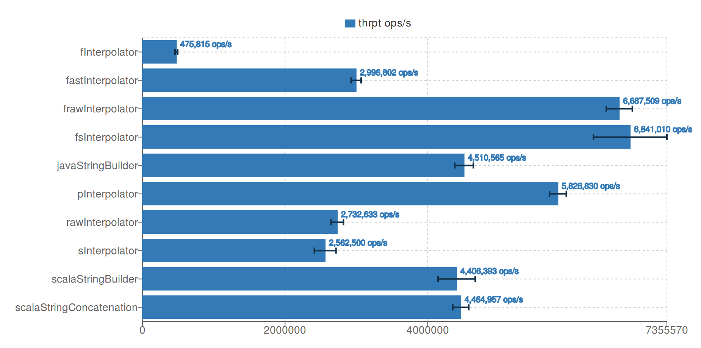
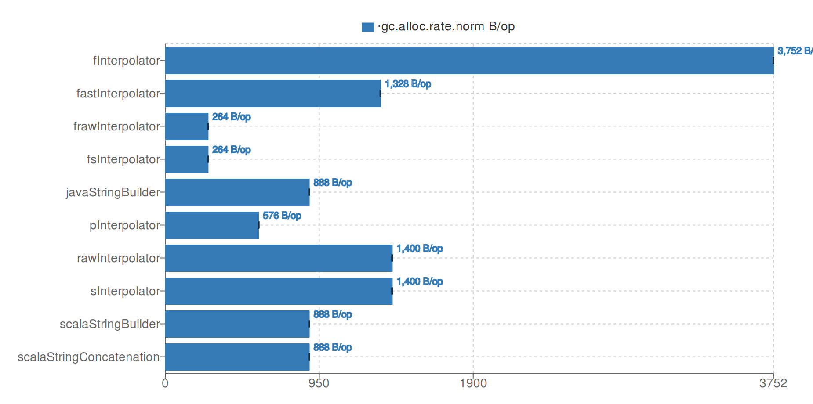

# Fast String Interpolator

[](https://travis-ci.org/Sizmek/fast-string-interpolator)
[](https://codecov.io/gh/Sizmek/fast-string-interpolator)

Scala macro that generates ultra-fast string interpolators.

## Goals, features, and limitations

A high-performance 100% compatible drop-in replacement of simple and raw string interpolators (`s""` or `raw""` literals).

Currently, it doesn't support formatting string interpolator (`f""` literal), however this will probably be added soon.

## How to use

The library is published to JCenter, so please add a resolver for it (or ensure that it is already added):

```sbt
resolvers += Resolver.jcenterRepo
```

Add the library to a dependency list in your `build.sbt` file:

```sbt
libraryDependencies += "com.sizmek.fsi" %% "macros" % "0.1.0"
```

Add import and replace prefix `s` by `fs` (or for a raw string interpolator `raw` by `fraw`):

```scala
import com.sizmek.fsi._

val host = "sizmek.com"
val path = "blog"
fs"http://$host/$path"
fraw"http://$host/$path"
```

That's it! You have got ~2.5x speed up in runtime and ~5x less usage of heap memory comparing to Scala interpolators
(numbers can vary depending on payload, JDK, and Scala versions).

Also, it is more efficient than a simple concatenation of strings by the `+` operator or using string builders for that.

Check for benchmark results where the fast string interpolator compared with
Scala interpolators, Scala/Java string builders, and a string concatenation using JDK 8 and Scala 2.12.4:
- *fInterpolator* - standard string interpolator with formatting
- *frawInterpolator* - fast string interpolator replacement for raw string interpolator  
- *fsInterpolator* - fast string interpolator replacement for simple string interpolator 
- *javaStringBuilder* - java.lang.StringBuilder
- *pInterpolator* - the [perfolation](https://github.com/outr/perfolation) interpolator
- *rawInterpolator* - standard raw string interpolator  
- *sInterpolator* - standard simple string interpolator 
- *scalaStringBuilder* - scala.collection.mutable.StringBuilder
- *scalaStringConcatenation* - `+` operand for strings 

[](docs/fast_string_interpolator_throughput.png)

[](docs/fast_string_interpolator_heap_usage.png)

### How it works

Let we have defined functions: `def f(): Int` and `def g(): Double`, then in compile-time for `fs"a${f()}bb${g()}"`
the following code will be generated:

```scala
{
  val fresh$macro$1: Int = f();
  val fresh$macro$2: Double = g();
  com.sizmek.fsi.`package`.stringBuilder().append('a').append(fresh$macro$1).append("bb").append(fresh$macro$2).toString();
}: String
```

You can check this by adding a compiler option: `scalacOptions += "-Ymacro-debug-lite"`.

In this code ```com.sizmek.fsi.`package`.stringBuilder()``` stands for getting a preallocated instance of
`java.lang.StringBuilder` from the thread-local pool.

By default a buffer capacity of all created `java.lang.StringBuilder` instances is 16384 characters (32Kb). If limit
is reached buffer size grows to ensure that whole string can fit in it. However next retrieval from the pool a new 
`java.lang.StringBuilder` instance will be allocated with the default size of the buffer and returned to avoid 
exhausting of Java heap. So if you want to work with longer strings without reallocations then set a greater value for 
the following JVM system property: `com.sizmek.fsi.buffer.size`.

## How to contribute

### Build

To compile, run tests, and check coverage for different Scala versions use a command:

```sh
sbt clean +coverage +test +coverageReport
```

### Run benchmarks

Feel free to modify benchmarks and check how it works on your payload, JDK, and Scala versions.

To see throughput with allocation rate for different approaches of string concatenation run benchmarks with GC profiler
for a specified Scala version using the following command:

```sh
sbt -no-colors ++2.12.4 clean 'benchmark/jmh:run -prof gc -rf json -rff jdk-8_scala-2.12.4.json .*'
```

It will save benchmark report in a specified JSON file.

Results that are stored in JSON can be easy plotted in [JMH Visualizer](http://jmh.morethan.io/) by drugging & dropping
of your file to the drop zone or using the `source` parameter with an HTTP link to your file in the URL like 
[here](http://jmh.morethan.io/?source=https://sizmek.github.io/fast-string-interpolator/jdk-8_scala-2.12.4.json).

[Results of benchmarks](https://sizmek.github.io/fast-string-interpolator) which compare performance of Fast String
Interpolator for different JDK and Scala versions.  

### Publish locally

Publish to the local Ivy repo:

```sh
sbt +publishLocal
```

Publish to the local Maven repo:

```sh
sbt +publishM2
```

### Release

For version numbering use [Recommended Versioning Scheme](http://docs.scala-lang.org/overviews/core/binary-compatibility-for-library-authors.html#recommended-versioning-scheme)
that is used in the Scala ecosystem.

Double check binary and source compatibility (including behavior) and run `release` command (credentials required):

```sh
sbt release
```

## Acknowledgments

A general idea and some parts of code was borrowed from an article ["Scala: String Interpolation Performance" by Dmitry Komanov](https://medium.com/@dkomanov/scala-string-interpolation-performance-21dc85e83afd).

An idea to use a thread-local cache for string builders come from an implementation of
[Jsoniter-scala - a most efficient JSON parser for Scala](https://github.com/plokhotnyuk/jsoniter-scala).
